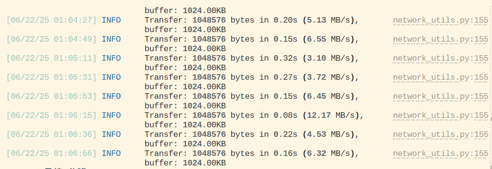
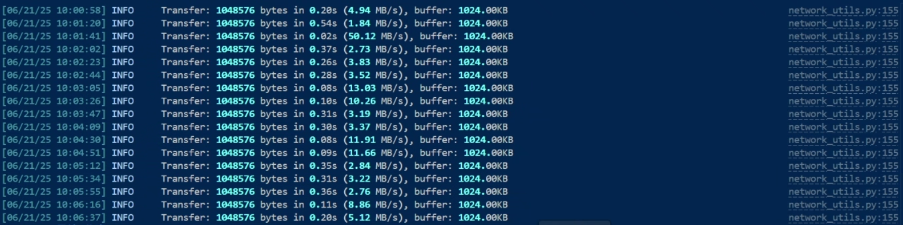
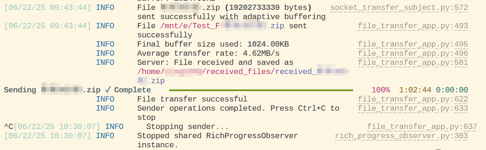
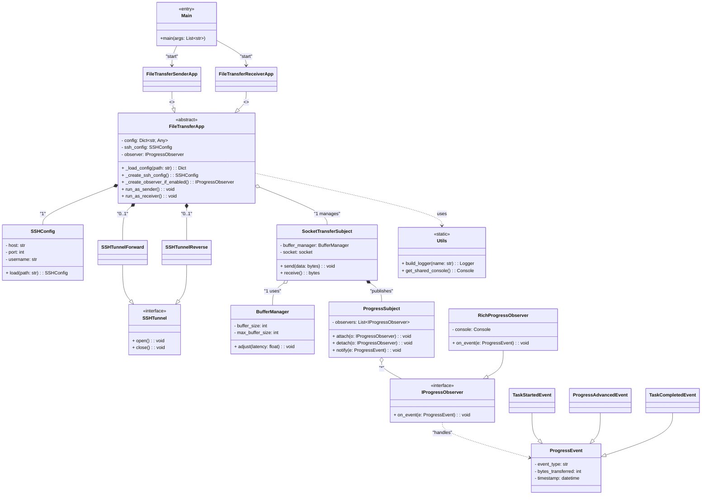

# File Transmission Application

This document provides an overview of the File Transmission application and its components. It features a sender and receiver that communicate over a jump server using SSH tunnels. The application is designed to transfer a file efficiently through sockets while providing real-time progress updates.

## Real performance
- The sender uses a broadband connection in China with an upload speed of 40 Mbps. 
- The receiver is located on the west coast of North America, with a network latency exceeding 230 ms.
- The following images demonstrate the actual transmission performance. The application logs the transfer rate after every 100 chunks sent. The average transfer rate is calculated by averaging these sampled rates. By default, the transfer rate is recorded once every 100 chunks, which provides a coarse measurement. For more accurate insights, refer to the real-time logging output, which better reflects the actual transfer speed.

**Example sender log output:**


**Example receiver log output:**


**Example sender log output upon completion:**


## Start the application

For the sender:
```bash
python core/file_transfer_app.py --config config_sender.yml
```

For the receiver:
```bash
python core/file_transfer_app.py --config config_receiver.yml
```

## Class Diagram

The following diagram illustrates the main classes in `file_transfer_app.py` and their relationships with components from the `core` module:


