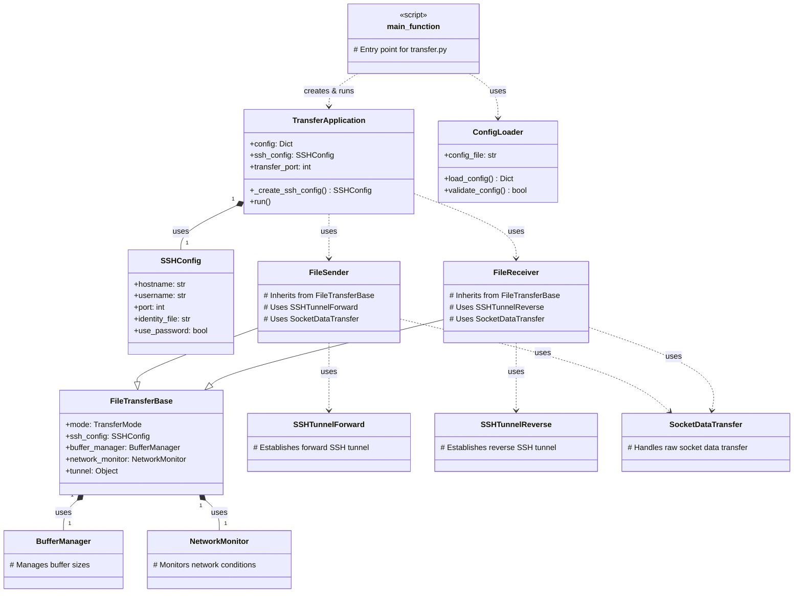

# File Transmission Application

This document provides an overview of the File Transmission application and its components.

## Start the application

For the sender:
```bash
python transfer.py --config config_sender.yml
```

For the receiver:
```bash
python transfer.py --config config_receiver.yml
```

## Class Diagram

The following diagram illustrates the main classes in `transfer.py` and their relationships with components from the `core` module:


